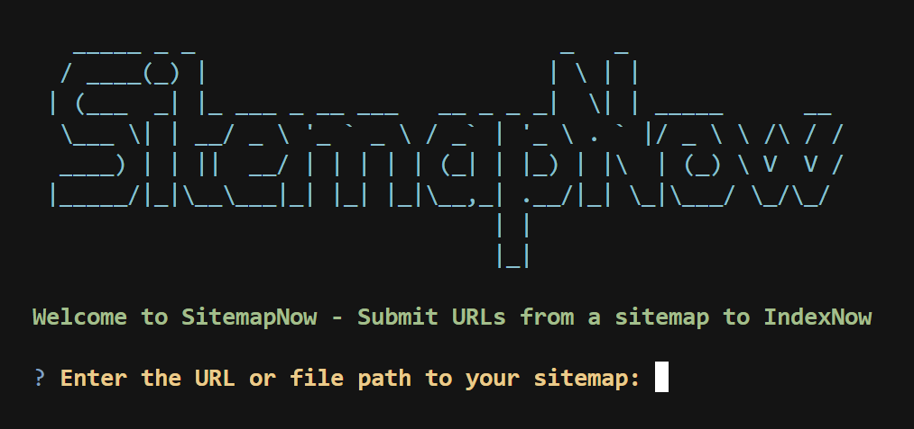
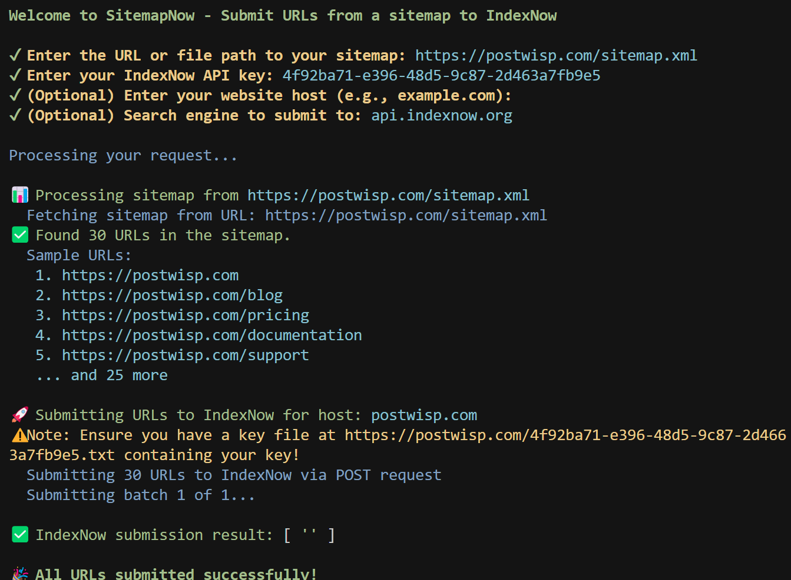

# 🚀 SitemapNow

<div align="center">

[](https://github.com/thejacedev/SitemapNow/actions)
[](https://www.npmjs.com/package/sitemapnow)

**A CLI tool to submit URLs from a sitemap to IndexNow, helping you get your website indexed faster by search engines.**

</div>

## ✨ Screenshots

<div align="center">
  
  <p><em>Interactive Mode</em></p>

  
  <p><em>Submission Complete</em></p>
</div>

## 📦 Installation

```bash
# Install globally
npm install -g sitemapnow

# Or run with npx
npx sitemapnow <options>
```

## 🔧 Usage

```bash
sitemapnow <sitemapLocation> [options]
```

### Arguments

- `sitemapLocation`: URL or file path to a sitemap (required)

### Options

- `-k, --key <apiKey>`: IndexNow API key (required)
- `-s, --site <siteUrl>`: Host of the website (if different from sitemap host)
- `-e, --engine <searchEngine>`: Search engine to submit to (default: api.indexnow.org)
- `-h, --help`: display help for command
- `-V, --version`: output the version number

## 🔑 Getting an API Key

Unlike many other APIs, you don't need to register to get an IndexNow API key. You can:

1. Generate your own key using a random string generator (8-128 characters, using only a-z, A-Z, 0-9, and the dash character)
2. Or create a UUID/GUID using an online generator
3. Or simply create a random string manually

The key only needs to be:
- At least 8 characters long (maximum 128)
- Contain only alphanumeric characters (a-z, A-Z, 0-9) and dashes (-)

<details>
<summary>Example valid keys</summary>

- `b90e064309544c8b9baf4d2f3f59eaca`
- `my-indexnow-key-2023`
- `a1b2c3d4-e5f6-g7h8-i9j0`
</details>

## ⚠️ Important: API Key Verification

Before using this tool, you **must** verify ownership of your website by hosting a key file:

1. Create a text file named `your-key.txt` (replace "your-key" with your actual API key)
2. The file should contain your API key as plain text
3. Host this file at the root of your website (e.g., https://example.com/your-key.txt)

Without this verification file, search engines will reject your submissions!

## 💡 Examples

```bash
# Submit URLs from an online sitemap
sitemapnow https://example.com/sitemap.xml -k your-indexnow-api-key

# Submit URLs from a local sitemap file
sitemapnow ./sitemap.xml -k your-indexnow-api-key -s example.com

# Submit to a specific search engine
sitemapnow https://example.com/sitemap.xml -k your-indexnow-api-key -e bing.com
```

## 🌐 About IndexNow

IndexNow is a protocol that enables website owners to notify search engines whenever content on their website is created, updated, or deleted. This allows for faster indexing of your website content.

For more information about IndexNow, visit [IndexNow.org](https://www.indexnow.org/).

## 👨‍💻 Development

This project uses GitHub Actions for CI. It runs tests, linting, and dependency checks on each push and pull request.

<details>
<summary>How to contribute</summary>

1. Fork the repository
2. Create your feature branch (`git checkout -b feature/amazing-feature`)
3. Commit your changes (`git commit -m 'Add some amazing feature'`)
4. Push to the branch (`git push origin feature/amazing-feature`)
5. Open a Pull Request
</details>

## 📚 Repository

[GitHub Repository](https://github.com/thejacedev/SitemapNow)

## 📄 License

This project is licensed under the [Apache License 2.0](./LICENSE).